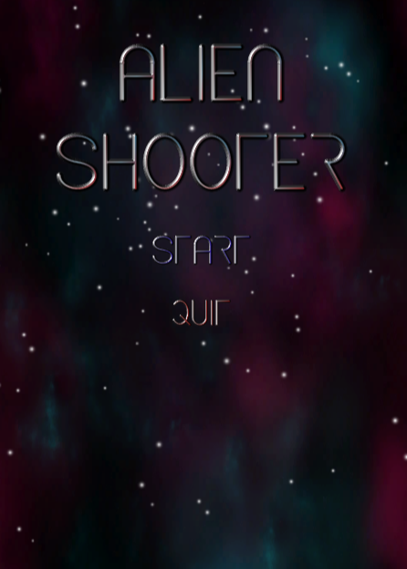
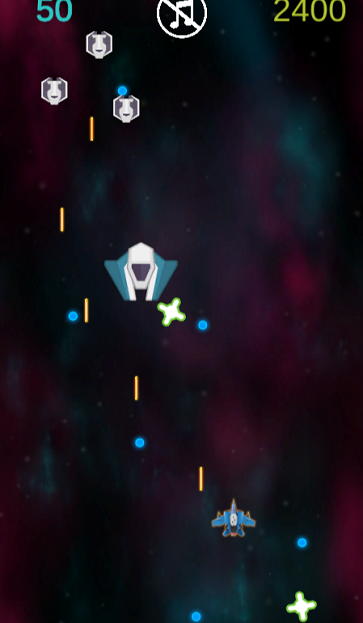

#  Laser Defender

 Laser Defender is a game made with Unity Game Engine and all scripts written in C#.
 

# Files
You can find all the game elements under "Assets/".
All the code is in "Assets/Scripts/".

## Enjoy the game

Click [here](https://itch.io/embed-upload/2808553?color=333333)  to play.

## Instructions

Use "ASDW'' or arrows to move.
"Space" to shoot.
Have fun!

## --------------------------------------------------------

